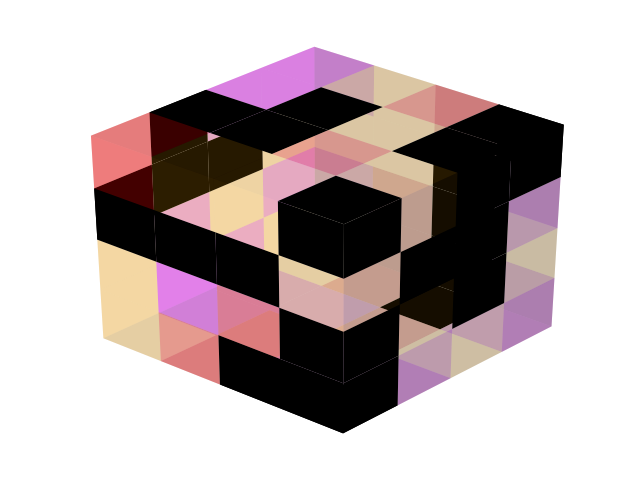
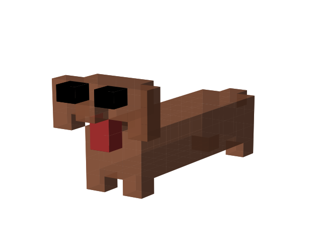
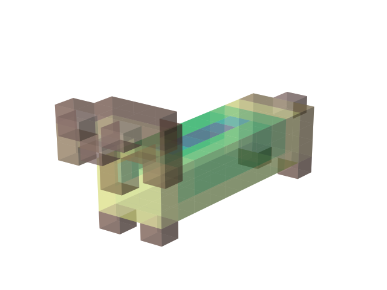

# voxelmap
A Python library for making voxel models from NumPy arrays.  

<!--  -->


## Installation

```ruby
pip install voxelmap
```

## Contributing / Hacktoberfest
Meaningful contributions to the project are always welcome. This project is also active as a part of Hacktoberfest 2021. Before making a PR, please make sure to read the [CONTRIBUTING](./CONTRIBUTING.md) document. 

You may use the Issues section of this repository if you'd like to propose some new ideas/enhancements or report a bug.

## Usage Examples

#### Draw a 3-D model from an array with custom voxel coloring scheme `voxels`

In:

```ruby
import voxelmap as vxm
import numpy as np

#make a 4x4x4 integer array with random values between 6 and 9
array = np.random.randint(6,10,(4,4,4))

#incorporate array to Model structure
model = vxm.Model(intarray)

#add voxel colors and alpha-transparency for integer values 6 - 9 (needed for `voxels` coloring)
model.customadd(6,'k')
model.customadd(7,'#e10af2',0.3)
model.customadd(8,'red',0.3)
model.customadd(9,'orange',0.2)

#draw array as a voxel model with `voxels` coloring scheme
model.draw('voxels')
```
Out:




#### Process an exported .txt file from a [Goxel](https://goxel.xyz/) project

In:

```ruby
import voxelmap as vxm
import numpy as np

'''process dog.txt from Goxel'''
gox = vxm.Goxel('../extra/dog.txt')

'hexanumerical colors in txt file; replace with integer for integer array'
gox.update_colors('8f563b',1)
gox.update_colors('ac3232',2)
gox.update_colors('000000',3)
gox.update_colors('ffffff',4)
dog = gox.importfile()      # turn txt file to array

dog = np.transpose(dog,(2,1,0))     #rotate dog

'load dog array to voxelmap Model'
model = vxm.Model(dog)

'draw with custom colors'
model.customadd(1,'#8f563b',0.8)
model.customadd(2,'#ac3232')
model.customadd(3,'#000000')
model.draw('voxels')

'draw with nuclear fill and terrain colormap'
model.gradmap(cm.terrain,0.5)
model.draw('nuclear')
```
Out: 




## Disclaimer: Use At Your Own Risk

This program is free software. It comes without any warranty, to the extent permitted by applicable law. You can redistribute it and/or modify it under the terms of the MIT LICENSE, as published by Andrew Garcia. See LICENSE below for more details.

[](http://badges.mit-license.org)

**[MIT license](./LICENSE)** Copyright 2022 © <a href="https://github.com/andrewrgarcia" target="_blank">Andrew Garcia</a>.
