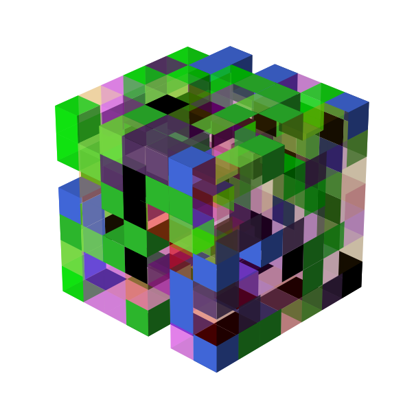

# voxelmap
A Python library for making voxel models from NumPy arrays.  

<!--  -->


## Installation

Coming soon
<!--
```ruby
pip install voxelmap
```
-->


## Contributing

Valuable contributions to the project are always welcome. Before making a PR, please make sure to read the [CONTRIBUTING](./CONTRIBUTING.md) document. 

You may use the Issues section of this repository if you'd like to propose some new ideas/enhancements or report a bug.

## Usage Example

Coming soon


## Disclaimer: Use At Your Own Risk

This program is free software. It comes without any warranty, to the extent permitted by applicable law. You can redistribute it and/or modify it under the terms of the MIT LICENSE, as published by Andrew Garcia. See LICENSE below for more details.

[](http://badges.mit-license.org)

**[MIT license](./LICENSE)** Copyright 2022 © <a href="https://github.com/andrewrgarcia" target="_blank">Andrew Garcia</a>.
