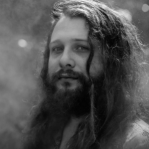

ImageMesh Portrait
======================

This script makes the 3-D model file (.obj format) from the below image.
The .obj file made in the last line may then be imported to a graphic editing software such as Blender
or viewed with ``voxelmap`` i.e. adding ``img.MeshView()`` after the last line

.. code-block:: python
    
    #galactic.py
    import voxelmap as vxm

    model = vxm.Model(file='galactic.png')       # load image 
    model.objfile = 'galactic.obj'          # set name of 3-D model file (.obj) to be made
    model.resize_intensity(0.25)                      # resize image to 25% its original size for feasible file size rendering
    model.MarchingMesh(25)                  # make 3-D model from image. 

.. |gal_blender| image:: ../../img/galactic_blender.png
  :width: 200
  :alt: Alternative text

.. |gal_mesh| image:: ../../img/galactic_mesh.png
  :width: 200
  :alt: Alternative text

|gal| |gal_blender| |gal_mesh| 

\*Photo used with permission from the `@galacticeffect <https://www.instagram.com/galacticeffect/>`_.