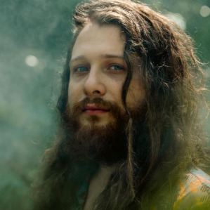
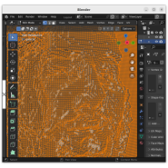
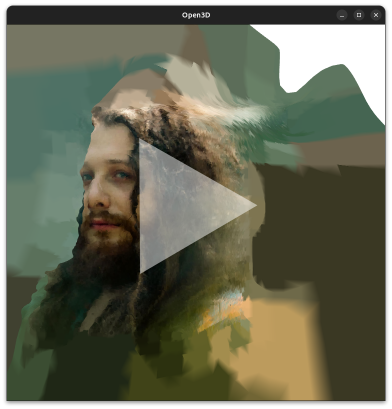

3-D Reconstruction
=======================

You can easily create stunning 3D models from images with voxelmap! This software package provides powerful geometric algorithms designed to reconstruct images,
with a primary focus on generating very simple depth fields from pixel intensity values. These algorithms include ImageMesh, which produces compact, low-poly models from images, and the well-known MarchingMesh algorithm, which creates detailed mesh representations at a higher computational cost.

With just a few lines of code, you can use this package to transform 2D images into high-quality,
immersive 3D models in the widely-used .obj format. 

.. |gal_mesh| image:: ../../img/galactic_mesh.png
  :width: 220
  :alt: Alternative text

|gal| |gal_mesh| 

\*Photo used with permission from the `@galacticeffect <https://www.instagram.com/galacticeffect/>`_. Check out his music `available at Spotify <https://open.spotify.com/artist/0d6aO1iQVWyxsN8UHfmHjm>`_

In the example below, the above artist portrait is loaded as a file to the Model class to create a 3-D model with the local MarchingMesh method, which generates 
an .obj file in the process:

.. code-block:: python
    
    #galactic.py
    import voxelmap as vxm

    model = vxm.Model(file='galactic.png')       # load image 
    model.objfile = 'galactic.obj'          # set name of 3-D model file (.obj) to be made
    model.MarchingMesh(25)                  # make 3-D model from image. 

Once you have the .obj file, you can import it into popular graphic editing software such as Blender for further customization and rendering. 
Alternatively, you can visualize the 3D model using the voxelmap library by calling the local **model.MeshView()** method after the last line of the script. 

Unleash your creativity with this user-friendly protocol for 3D reconstruction from images.

Coming Soon : AI-based 3-D Reconstruction
-----------------------------------------------------

With voxelmap, we are committed to continually improving our project with the latest technological advancements. 
As part of our ongoing development, we are planning to introduce more advanced methods for 3-D reconstruction using artificial intelligence in a future release, version 5.0.

|o3dgal2|

These new method(s) will provide higher quality 3-D reconstruction, and enable users to go from image to 3-D model with just one line of code. Our aim is to democratize the 3-D modeling process and make it more accessible to everyone.

