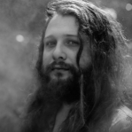

3-D Reconstruction
=======================

You can easily create stunning 3D models from images with voxelmap! By adapting the below script with an image of your choice, you can generate high-quality 3D models in the widely-used .obj format. With just a few lines of code, you can transform 2D images into immersive 3D worlds. 
Once you have the .obj file, you can import it into popular graphic editing software like Blender for further customization and rendering. 

.. code-block:: python
    
    #galactic.py
    import voxelmap as vxm

    model = vxm.Model(file='galactic.png')       # load image 
    model.objfile = 'galactic.obj'          # set name of 3-D model file (.obj) to be made
    model.MarchingMesh(25)                  # make 3-D model from image. 

.. |gal_blender| image:: ../../img/galactic_blender.png
  :width: 200
  :alt: Alternative text

.. |gal_mesh| image:: ../../img/galactic_mesh.png
  :width: 200
  :alt: Alternative text

|gal| |gal_blender| |gal_mesh| 

Alternatively, you can quickly visualize the 3D model using the voxelmap library by adding **img.MeshView()** after the last line of the script. 
Unleash your creativity with this user-friendly protocol for 3D reconstruction from images

\*Photo used with permission from the `@galacticeffect <https://www.instagram.com/galacticeffect/>`_.