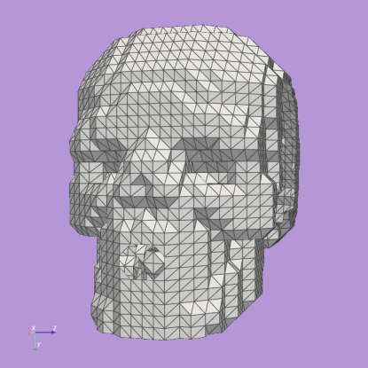

Voxel Model to 3-D Mesh
==========================

Voxelmap can transform a voxel model from Goxel, which is saved as a text file (.txt), into a more lifelike 3D mesh using the Marching Cubes algorithm. 
You can start by downloading the .txt file, which can be achieved by entering a certain text in your command line.

>>> wget https://raw.githubusercontent.com/andrewrgarcia/voxelmap/main/model_files/skull.txt

Then in the same directory, create skull.py script with the following code:

.. code-block:: python

    #skull.py
    import voxelmap as vxm

    model = vxm.Model()

    model.load('extra/skull.txt')

    arr = model.array 

    model.array = model.array[::-1]

    'draw in standard voxel form'
    model.draw('voxels',wireframe=True, background_color='#3e404e',window_size=[700,700])

    'to convert to mesh'
    model.MarchingMesh()
    model.MeshView(wireframe=True,alpha=1,color=True,background_color='#b064fd',viewport=[700,700])

Running the above script will give you the below image

