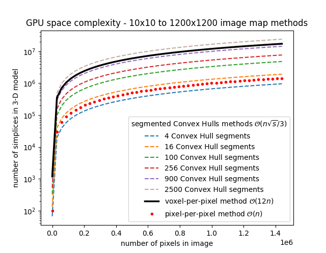

ImageMesh : A Convex Hull based 3D Reconstruction Method
============================================================

**Andrew R. Garcia**

garcia.gtr@gmail.com

.. 
  last web revision: Dec 2022
  revised as whitepaper: Mar 2023

Abstract:
-------------------------------

ImageMesh is a method available in versions :math:`\ge` 2.0 of the voxelmap Python library that generates 3D models from images using Convex Hull in 3-D to enclose external 
points obtained from a series of partitioned point clouds. These point clouds are generated by assigning the relative pixel intensities from the partitioned images 
as the depth dimension to the points. In this paper, we describe the limitations of the original ImageMesh method and the quick solution we have implemented to address them. 
Additionally, we introduce MeshView, a Python visualization tool developed in tandem with ImageMesh that provides a convenient way to visualize the 3D models generated by ImageMesh.
Finally, we discuss the GPU memory space complexity of both methods.

Introduction:
-----------------

.. figure:: ../img/imagemesh/donut.png
  :width: 250
  :alt: Image of a Donut

  An image of a crochet donut 

  3-D reconstruction of donut image with ImageMesh

ImageMesh is a 3D reconstruction method. It utilizes Convex Hull in 3-D to enclose external points obtained from a series of partitioned point clouds, 
which are generated by assigning the relative pixel intensities from the partitioned images as the depth dimension to the point clouds.
ImageMesh generates 3-D model .obj files from images by drawing the smallest collection of triangular polygons that satisfies this rule in three-dimensional space. 
In simpler terms, it's like placing a fabric over a 3-D object. However, it is important to note that a single convex hull operation may fail to draw a structure with holes or bumps,
which are essentially 2-D local extrema.

To address this limitation, we have implemented a quick solution that involves partitioning the input image into multiple segments and placing 3-D convex hull "sheets" on each segment to perform triangulation. 
Figure 3 shows how this partitioning can process more local extrema with the 3-D Convex Hull method and create more realistic 3-D reconstructions. 

.. figure:: ../img/imagemesh/method.png
  :width: 550
  :alt: ImageMesh method

  Schematic representation of the performance of ImageMesh with more segments. 

In the Figure 4, blurring is performed to create a more realistic 3-D texture with the ImageMesh method. 
Blurring an image can be thought of as a process of smoothing out the details in the image by reducing the contrast between adjacent pixels.
This results in a 3-D effect where the image appears to have a more uniform and continuous surface. 
Instead of sharp edges and abrupt changes in color or texture, blurred images have a softer and more gradual transition between different parts of the image.

.. figure:: ../img/imagemesh/landim.png
  :width: 550
  :alt: Land IM

  Blurring of former image to create a smoother 3-D texture with ImageMesh. 

Complementing ImageMesh is MeshView, a Python visualization tool developed in tandem to provide a convenient way to visualize the 3D models generated by ImageMesh. 
MeshView is capable of loading the .obj files generated by ImageMesh and rendering them in a PyVista VTK window, allowing for interactive 3D visualization of the models

  
  The graphical effect of increasing the number of 3-D Convex Hull (CH) sectors in each column. The left column shows 1 CH sector, the middle column shows 4 CH sectors, and the right column shows 16 CH sectors.

GPU Memory Space Complexity:
--------------------------------

In this section, we will discuss the GPU memory space complexity of the two methods used in ImageMesh. The voxel-per-pixel method used in earlier versions of ImageMesh
involves rendering a cube from every "n" input point, with each cube comprising 12 triangles in computer graphics. As a result, the GPU space complexity of this method is 
:math:`\mathcal{O}(12 n)`

To improve on this method, the new Convex Hull method uses the input points as vertices to form triangles that make up a polyhedron in 3-D space. Additionally, 
this method partitions the image into "s" sectors to increase resolution. The space complexity of the new method approximates to
:math:`\mathcal{O}(n \sqrt{s}/3)`
, which is significantly
lower than the voxel-per-pixel method. 

.. _fig-main:

  Space complexity for graphics represented by the number of simplices made for the 3-D model from an image with :math:`x` number of pixels.

In simpler terms, the new method reduces the amount of GPU memory required to generate 3D models from images, making it more efficient and scalable for large datasets. 
This reduction in GPU memory space complexity is a significant advantage of the Convex Hull method over the voxel-per-pixel method.

Conclusion:
-----------------

ImageMesh, coupled with MeshView, provides a powerful and efficient 3D reconstruction method. By implementing the Convex Hull-based method with partitioning,
we have addressed the limitation of a single convex hull operation and increased the resolution of the reconstructed 3D models. With the reduction in GPU space complexity,
the new method has become more practical for real-world applications.

