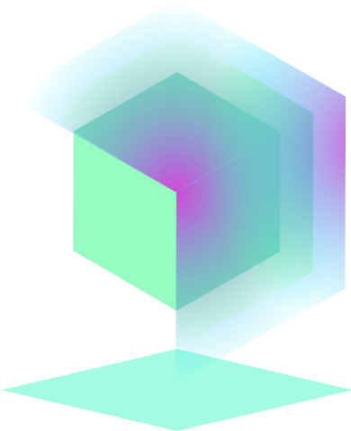
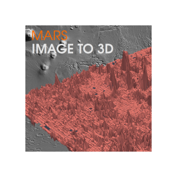
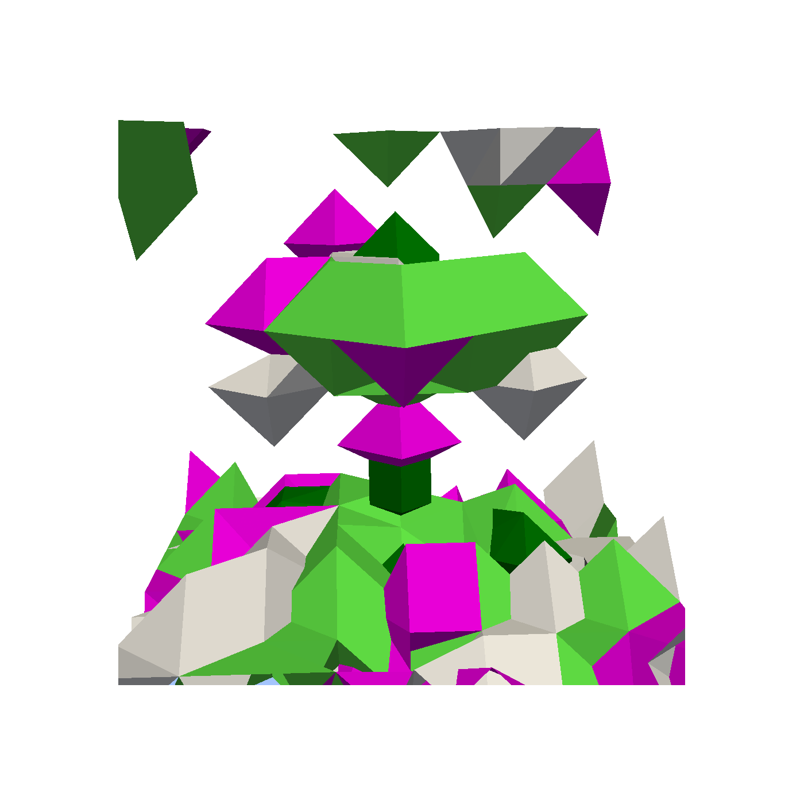
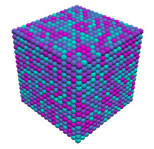
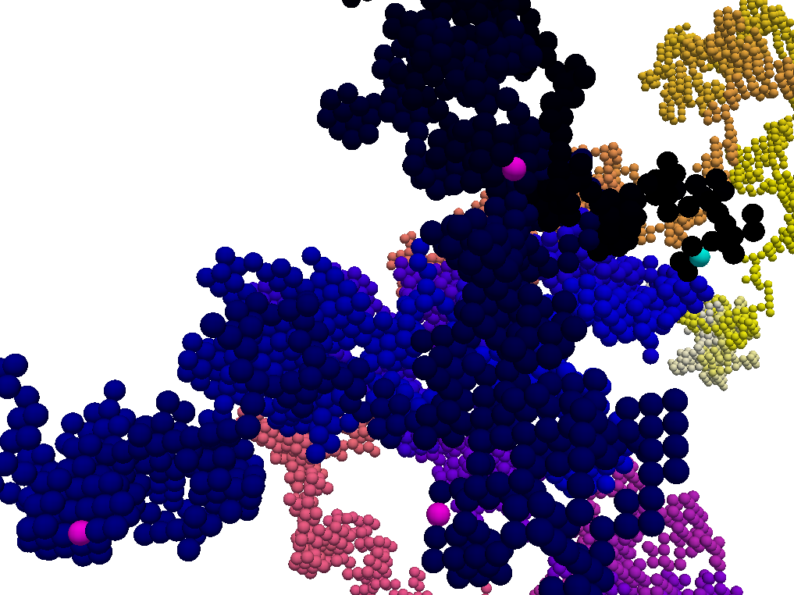
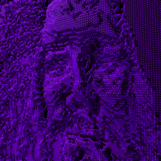
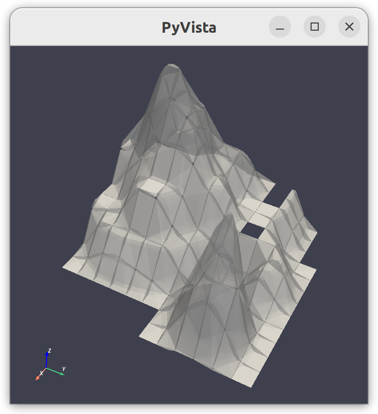
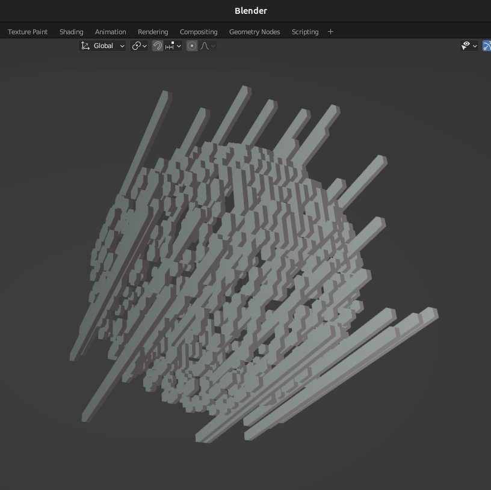

Welcome to voxelmap's documentation!
=======================================

Let's make 3-D models with Python!
-----------------------------------

  `Check out voxelmap's open-source on GitHub <https://github.com/andrewrgarcia/voxelmap>`_

Ever wanted to make simple 3-D models from numpy arrays? Now you can do that with voxelmap ! **Voxelmap** is a Python library for 
making voxel and three-dimensional models from NumPy arrays. It was initially made to streamline 3-D voxel modeling by assigning each
integer in an array to a voxel. Now, methods are being developed for mesh representations, such as **ImageMesh**, voxel-to-mesh transformation and vice-versa. 

Check out the :doc:`usage` section for further information, including how to :ref:`installation` the project. For some quick examples / templates, check out the next section. 

Key Features
..............................

..
  .. |islandmesh| image:: ../img/argisle.png
    :width: 200
    :alt: Alternative text

  

.. |skullmesh| image:: ../img/skull_mesh.png
  :width: 200
  :alt: Alternative text

+------------------------+-----------------------+--------------------------+
| |cmapcube|             | |randomwalk|          |  |galactic|              |
+------------------------+-----------------------+--------------------------+
| :ref:`voxeldraw_array` |  :ref:`blockcol`      |  :doc:`examples/meshrec` | 
+------------------------+-----------------------+--------------------------+
| |lowpoly|              | |skullmesh|           |  |pillars_blender|       |
+------------------------+-----------------------+--------------------------+
| :ref:`lowpolyimgmesh`  | :doc:`examples/skull` | :ref:`modelobjman`       |
+------------------------+-----------------------+--------------------------+

.. 
  |islandmesh| |skullmesh| |galactic|

Colab Notebook
..............................

While we offer an interactive tutorial via a Colab notebook, we recommend using this site as your primary guide instead. Please note that the Colab notebook is currently out-of-date and may not reflect the most recent features and functionality of Voxelmap. We are continually updating our website to ensure the latest information and resources are available to our users.

.. image:: ../img/colaboratory.png
  :width: 500
  :alt: Alternative text
  :target: https://colab.research.google.com/drive/1RMEMgZHlk_tKAzfS4QfXLJV9joDgdh8N?usp=sharing

.. note::

   This project is under active development.

Contents
--------

.. toctree::

   usage
   api

Examples
-----------------------

.. toctree::
  
   examples/skull
   examples/meshrec

Whitepapers
-----------------------

.. toctree::

   imagemesh