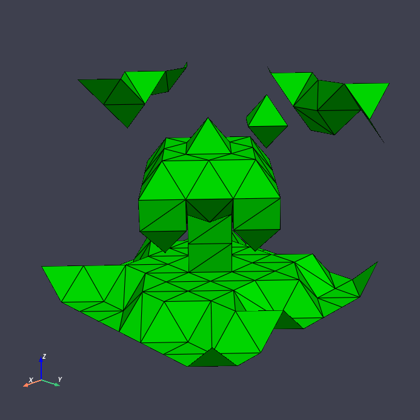

Welcome to voxelmap's documentation!
=======================================

Let's make 3-D models with Python!
-----------------------------------

|pic1| |pic2|

Ever wanted to make simple 3-D models from numpy arrays? Now you can do that with voxelmap ! **Voxelmap** is a Python library for 
making voxel and three-dimensional models from NumPy arrays. It was initially made to streamline 3-D voxel modeling by assigning each
integer in an array to a voxel. Now, methods are being developed for mesh representations, voxel-to-mesh transformation and vice-versa. 

Clickable examples
..............................
Click on the images below for their source code.

.. |island| image:: ../img/island.png
  :width: 200
  :alt: Alternative text
  :target: https://andrewatcloud.com/voxelmap/island.html

.. |skullmesh| image:: ../img/skull_mesh.png
  :width: 200
  :alt: Alternative text
  :target: https://andrewatcloud.com/voxelmap/skull.html

|island| |skullmesh| |galactic| 

Check out the :doc:`usage` section for further information, including how to :ref:`installation` the project.

You may also click on the image below for a nice, interactive tutorial through a Colab notebook:

.. image:: ../img/colaboratory.png
  :width: 500
  :alt: Alternative text
  :target: https://colab.research.google.com/drive/1RMEMgZHlk_tKAzfS4QfXLJV9joDgdh8N?usp=sharing

.. note::

   This project is under active development.

Contents
--------

.. toctree::

   usage
   api
