Usage
=====

.. _installation:

Installation
------------

It is recommended you use voxelmap through a virtual environment. You may follow the below simple protocol to create the virtual environment, run it, and install the package there:

.. code-block:: console
   
   $ virtualenv venv
   $ source venv/bin/activate
   (.venv) $ pip install voxelmap

To exit the virtual environment, simply type ``deactivate``. To access it at any other time again, enter with the above ``source`` command.

The ``hashblocks`` Constructor Variable
-------------------------------------------

**Voxelmap** was originally made to handle third-order integer arrays of the form ``np.array((int,int,int))`` as blueprints to 3-D voxel models. 

While **"0"** integers are used to represent empty space, **non-zero integers** are used to define a distinct voxel type and thus, 
they are used as keys for such voxel type to be mapped to a specific color and ``alpha`` transparency. These keys are stored in a map (also known as "dictionary") 
internal to the ``voxelmap.Model`` class called ``hashblocks``. 

The ``hashblocks`` dictionary contains an entry for each integer key, 
where the corresponding value is a list. This list contains two elements: 
a string that represents the color in either the hex format (#rrggbb) or as a color label (e.g., 'red') 
as the first element, and a float between 0 and 1 that represents the alpha transparency as the second element. 
The dictionary's structure and call method are shown below:

.. code-block:: python

   import voxelmap as vxm

   model = vxm.Model()

   model.hashblocks = {
      key_1 (int): ['#rrggbb' (string) ,alpha (float)]
      key_2 (int): ['#rrggbb' (string) ,alpha (float)]
      .
      .  
      .
   }

.. _voxeldraw_array:

Draw voxels from integer arrays
-------------------------------------

We present the creation of two models using arrays A and B, with the first code block dedicated to the generation of the first model (array A) containing thorough comments for better understanding of the voxelmap functions.

.. code-block:: python

  '''Array A'''

  #make a 10x10x10 integer array with values between 0 and 3 with sampling probabilities "p"
  freqs = [300,20,40,20]    
  A = np.random.choice([0,1,2,3],p=freqs/np.sum(freqs),size=(10, 10, 10))

  #incorporate array to Model structure
  model = vxm.Model(A)

  #add voxel colors and alpha-transparency for integer values 0 - 9 (needed for `custom` coloring)
  colors = ['#ff000ff', 'yellow', 'lime']

  alpha_yellow=0.4    # define alpha transparency for yellow colored voxels

  #assign colors and alpha to integers
  k=1
  for i in colors:
      model.hashblocks[k] = [i,1] if i != 'yellow' else [i,alpha_yellow]
      k+=1

  model.draw(coloring='custom',len_voxel=0.9, background_color='#ffffff')

  '''Array B'''

  B = np.random.randint(1,30,(7,7,7))
  vxm.Model(B).draw(coloring='cmap: cool, alpha:1.0',geometry='particles',len_voxel=1,background_color='w')

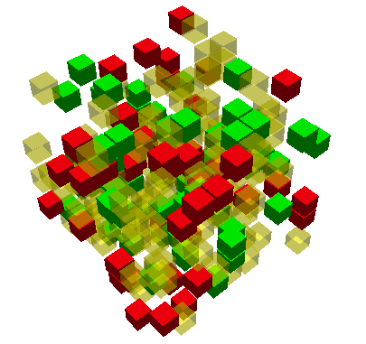

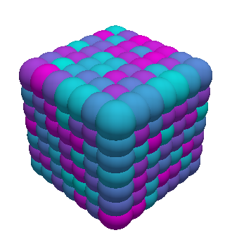

It's worth noting the versatility of voxelmap, allowing the creation of 3D models using just one line of code, as demonstrated with the generation of array B.

Draw voxels from coordinate arrays 
-------------------------------------

Voxelmap has the capability to create a voxel model using an array that defines the coordinates of each voxel in x, y, and z space. The variable "data.xyz" takes a third-order array, where the rows represent the number of voxels and the columns contain the 3 coordinates for each axis.

Additionally, the "data.rgb" input can be used to set the color of each voxel in the "data.xyz" object using the hex format "xxxxxx" (for example, "ffffff" for white).

The algorithm works with negative coordinates as well, as demonstrated in the example below. This example showcases two cases, where the second case places the spheres farther apart by reducing the characteristic length scale of the particles (i.e., the radius) using the "len_voxel" keyword argument.

.. code-block:: python

  cubes = vxm.Model()
  num_voxels = 30
  cubes.XYZ = np.random.randint(-1,1,(num_voxels,3))+np.random.random((num_voxels,3))          # random x,y,z locs for 10 voxels
  cubes.RGB = [ hex(np.random.randint(0.5e7,1.5e7))[2:] for i in range(num_voxels) ]   # define random colors for the 10 voxels
  cubes.sparsity = 10
                                                    # spaces out coordinates
  cubes.load(coords=True)
  cubes.hashblocks

  print(cubes.hashblocks)

  # print(cubes.XYZ)                               # print the xyz coordinate data
  cubes.draw(coloring='custom',geometry='particles',len_voxel=1, background_color='#ffffff',window_size=[416, 416]) 

  # increase spacing by setting the `len_voxel` characteristic side-length to a lower number. 
  cubes.draw(coloring='custom',geometry='particles',len_voxel=0.5, background_color='#ffffff',window_size=[416, 416]) 

>>> [Out]
Voxelmap draw. Using custom colors:
self.hashblocks =
 {1: ['#4d3206', 1], 2: ['#4f29cc', 1], 3: ['#52c64a', 1], 4: ['#5c8c76', 1], 5: ['#617fc0', 1], 6: ['#6622fa', 1], 7: ['#668b58', 1], 8: ['#6cb872', 1], 9: ['#701eda', 1], 10: ['#76aa8b', 1], 11: ['#783ec3', 1], 12: ['#7b2af8', 1], 13: ['#80e30b', 1], 14: ['#8105f8', 1], 15: ['#842c4c', 1], 16: ['#89c2d5', 1], 17: ['#934959', 1], 18: ['#9a539c', 1], 19: ['#9f3fae', 1], 20: ['#a5b909', 1], 21: ['#a9f373', 1], 22: ['#b818a6', 1], 23: ['#bcf032', 1], 24: ['#bd0374', 1], 25: ['#bdd493', 1], 26: ['#c20eff', 1], 27: ['#c9c6fe', 1], 28: ['#c9ea55', 1], 29: ['#cc8e6f', 1], 30: ['#d553d4', 1]}

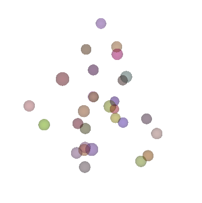

>>> [Out]
Voxelmap draw. Using custom colors:
self.hashblocks =
 {1: ['#4d3206', 1], 2: ['#4f29cc', 1], 3: ['#52c64a', 1], 4: ['#5c8c76', 1], 5: ['#617fc0', 1], 6: ['#6622fa', 1], 7: ['#668b58', 1], 8: ['#6cb872', 1], 9: ['#701eda', 1], 10: ['#76aa8b', 1], 11: ['#783ec3', 1], 12: ['#7b2af8', 1], 13: ['#80e30b', 1], 14: ['#8105f8', 1], 15: ['#842c4c', 1], 16: ['#89c2d5', 1], 17: ['#934959', 1], 18: ['#9a539c', 1], 19: ['#9f3fae', 1], 20: ['#a5b909', 1], 21: ['#a9f373', 1], 22: ['#b818a6', 1], 23: ['#bcf032', 1], 24: ['#bd0374', 1], 25: ['#bdd493', 1], 26: ['#c20eff', 1], 27: ['#c9c6fe', 1], 28: ['#c9ea55', 1], 29: ['#cc8e6f', 1], 30: ['#d553d4', 1]}

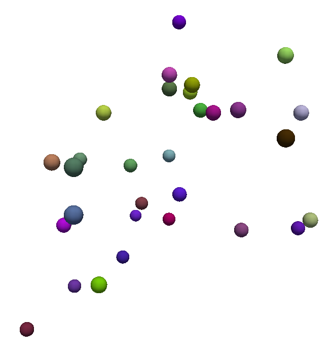

.. _blockcol:

Colormap Block Coloring
-------------------------------------

The coloring kwarg for the draw method now has a ``'cmap'`` string option to assign colors from a colormap to the defined voxel types (i.e. the 
non-zero integers in the 3-D arrays). Download the `RANDOMWALK.JSON <https://raw.githubusercontent.com/andrewrgarcia/voxelmap/main/model_files/randomwalk.json>`_ file
and save it in the same directory where you are running these examples. If you inspect the .json file, you'll see the following structure:

.. code-block:: python

   {
      "hashblocks": {},
      "size": [300, 300, 300],
      "coords": [
         [146, 149, 152],
         [146, 150, 152],
         [147, 148, 153],
         [147, 148, 154],
         .
         .
         .
         [197, 142, 132],
         [197, 143, 132]
      ],
      "val": [7, 6, 24, 25, . . ., 3182, 3183]
   }

The file contains information about a 3-D array, including its dimensions (specified by the ``size`` key), 
the 3-D coordinates of its non-zero integers (specified by the ``coords`` key), and the corresponding integer values (specified by the ``val`` key). 
It's worth noting that the hashblocks dictionary is currently empty. 

When using the 'cmap:' option to color the array, 
the **hashblocks** dictionary is built based on a linear relation between the chosen colormap and the values of the integers in the array, 
similar to how a gradient coloring would work. In the code block below, 
the `RANDOMWALK.JSON <https://raw.githubusercontent.com/andrewrgarcia/voxelmap/main/model_files/randomwalk.json>`_ model is 
drawn using the **gnuplot2** colormap with an **alpha** of 1. 

Note that this file generates a model that requires a substantial amount of memory, which may result in a longer rendering time.

.. code-block:: python

    model = vxm.Model()

    model.load('randomwalk.json')
    model.draw(coloring='cmap: gnuplot2, alpha:1',geometry='particles',background_color='w')

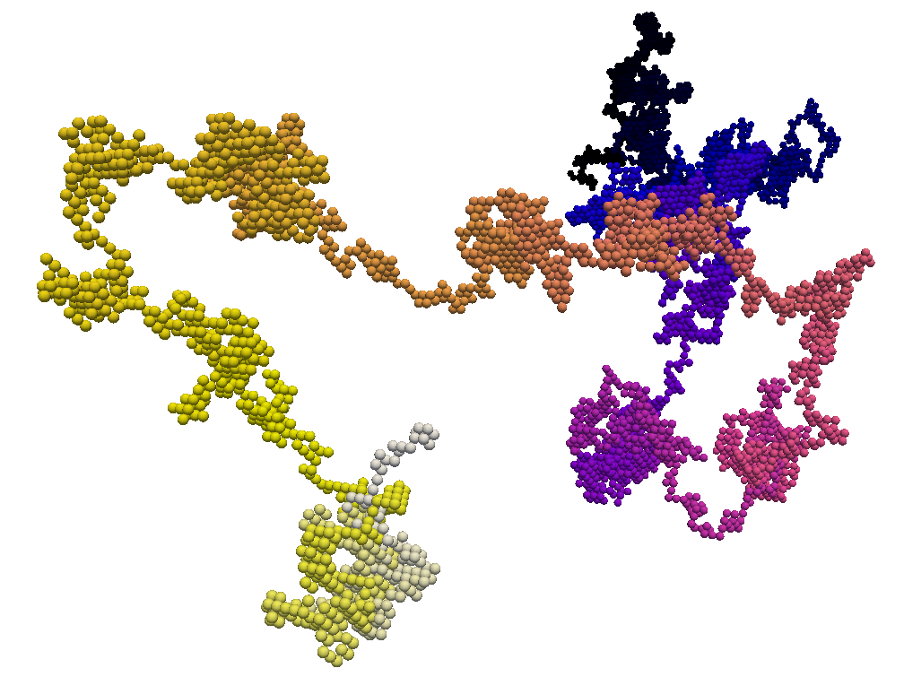

Colormap Block Coloring with Integer Tagging
................................................

The **hashblocks** map can be used in combination with the 'cmap' coloring option to selectively color-tag specific voxels based on their type. 
To accomplish this, we can modify the previous code block by adding a model.hashblocks declaration after model.load(). 
This will allow us to color the voxels represented by the integers 743, 500, and 256 in magenta, and the voxel represented by integer 2 in cyan.

.. code-block:: python

    model = vxm.Model()

    model.load('randomwalk.json')

    # add the hashblocks voxel assignments    
    model.hashblocks = {
      743: ['magenta',1],
      500: ['magenta',1],
      256: ['magenta',1],
      2: ['cyan',1]
    }

    model.draw(coloring='cmap: gnuplot2, alpha:1',geometry='particles',background_color='w')

.. image:: ../img/randomwalk_tagged.png
  :width:  900
  :alt: Alternative text

The ability to use the hashblocks map with the 'cmap' coloring option can be a valuable feature when
we need to represent multiple relationships simultaneously. For example, we can use a gradient of values 
described by the colormap to color the array, while simultaneously highlighting specific voxels with hashblocks. 
This technique can have numerous applications in fields such as 3-D modeling, medical imaging, and coarse-grained molecular modeling, among others.

3-D Mapping of an Image
--------------------------------

Here we map the synthetic topography `LAND IMAGE (.png) <https://raw.githubusercontent.com/andrewrgarcia/voxelmap/main/docs/img/land.png>`_  to a 
3-D model using the ``ImageMap`` method from the ``voxelmap.Model`` class.

.. code-block:: python

   #import packages
   import cv2
   import matplotlib.pyplot as plt

   plt.imshow(cv2.imread('docs/img/land.png'))      # display fake land topography .png file as plot
   plt.axis('off')
   plt.show()

   #import packages
   import numpy as np
   from matplotlib import cm

   model = vxm.Model(file='docs/img/land.png')             # incorporate fake land topography .png file to voxelmap.Image class
   print(model.array.shape)

.. image:: ../img/land_small.png
  :width: 200
  :alt: Alternative text

The image is then resized for the voxel draw with the matplotlib method i.e. ``Model().draw_mpl``. This is done with ``cv2.resize``, resizing the image from 1060x1060 to 50x50. 
After resizing, we convolve the image to obtain a less sharp color shift between the different gray regions with the ``cv2.blur`` method:

.. code-block:: python

   model.array = cv2.resize(model.array, (50,50), interpolation = cv2.INTER_AREA)
   print(model.array.shape)

   model.array = cv2.blur(model.array,(10,10))    # blur the image for realiztic topography levels
   plt.imshow(model.array)      # display fake land topography .png file as plot
   plt.axis('off')
   plt.show()

.. image:: ../img/land_blurred.png
  :width: 200
  :alt: Alternative text

After this treatment, the resized and blurred image is mapped to a 3-D voxel model using the `ImageMap` method from the `Model` class:

.. code-block:: python

   model.array = model.ImageMap(12)              # mapped to 3d with a depth of 12 voxels
   print(model.array.shape)

   model.draw('none',background_color='#ffffff')

.. image:: ../img/land_imagemap.png
  :width: 350
  :alt: Alternative text

.. _lowpolyimgmesh:

Low-Poly 3-D Mesh Mapping from Image
-----------------------------------------

The ImageMesh method creates a low-poly mesh model from an Image using an algorithm developed by Andrew Garcia where 3-D convex hull is performed on separate "cuts" or sectors from the image (see: :doc:`imagemesh`). 

This can decrease the size of the 3-D model and the runtime to generate it significantly, making the runtime proportional to the number of sectors rather than the number of pixels. Sectors are quantified with the L_sectors kwarg, which is the length scale for the number of sectors in the grid. 

We can see that the mesh model can be calculated and drawn with matplotlib ``plot=mpl`` option even from a large image of 1060x1060 without resizing:

.. code-block:: python

   import voxelmap as vxm
   import cv2 

   model = vxm.Model(file='docs/img/land.png')   # incorporate fake land topography .png file

   print(model.array.shape)

   model.ImageMesh(out_file='scene.obj', L_sectors = 15, trace_min=5, rel_depth = 20, figsize=(15,12), plot='mpl')

.. image:: ../img/land_imagemesh.png
  :width: 350
  :alt: Alternative text

This ``ImageMesh`` transformation is also tested with a blurred version of the image with ``cv2.blur``. A more smooth low-poly 3-D mesh is generated with this additional treatment. The topography seems more realistic:

.. code-block:: python

   model.array = cv2.blur(model.array,(60,60))    # blur the image for realiztic topography levels
   model.ImageMesh(out_file='scene.obj', L_sectors = 15, trace_min=5, rel_depth = 20, figsize=(15,12), plot='mpl')

.. image:: ../img/land_imagemesh_blur.png
  :width: 350
  :alt: Alternative text

For a more customizable OpenGL rendering, ``img.MeshView()`` may be used on the above image:

.. code-block:: python

   import voxelmap as vxm
   import numpy as np
   import cv2 as cv

   model = vxm.Model(file='docs/img/land.png')           # incorporate fake land topography .png file
   model.array = cv.blur(model.array,(100,100))    # blur the image for realistic topography levels

   # model.make()                                  # resized to 1.0x original size i.e. not resized (default)

   model.ImageMesh('land.obj',  12, 14, 1, False, figsize=(10,10))

   model.MeshView( alpha=0.7,background_color='#3e404e',color='white',viewport=(700, 700))

.. image:: ../img/land_meshview.png
  :width: 350
  :alt: Alternative text

MarchingMesh : Turning Voxel Models to 3-D Mesh Representations
-------------------------------------------------------------------

Click on the links below to save the files in the same directory you are running these examples:

`DOG MODEL (.txt) <https://raw.githubusercontent.com/andrewrgarcia/voxelmap/main/model_files/dog.txt>`_

`ISLAND MODEL (.txt) <https://raw.githubusercontent.com/andrewrgarcia/voxelmap/main/model_files/argisle.txt>`_

The ``.txt`` files you downloaded were exported from Goxel projects. 

Goxel is an open-source and cross-platform voxel editor which facilitates the graphical creation of voxel models. More information by clicking the icon link below.  

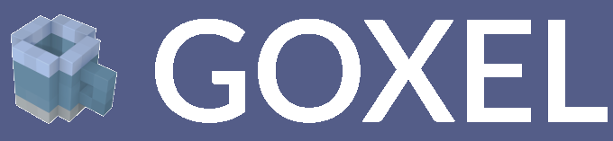

We first load those ``.txt`` files with the below voxelmap methods: 

.. code-block:: python

   import voxelmap as vxm
   import numpy as np

   '''process argisle.txt from Goxel'''
   theIsland = vxm.Model()
   theIsland.load('argisle.txt')
   theIsland.array = np.transpose(theIsland.array,(2,1,0))    #rotate island
   theIsland.draw('custom',background_color='white')

   '''process dog.txt from Goxel'''
   Dog = vxm.Model()
   Dog.load('dog.txt')
   Dog.array = np.transpose(Dog.array,(2,1,0))     #rotate dog
   Dog.draw('custom',background_color='white')

.. |voxisland| image:: ../img/fromgoxel_1.png
  :width:  300
  :alt: Alternative text

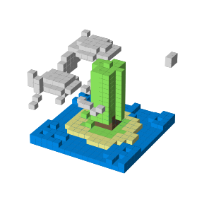

|voxisland|           |voxdog|

The voxel models can be transformed to 3D mesh representations with voxelmap's ``Model().MarchingMesh`` method, which uses `Marching Cubes` from the ``scikit-image`` Python library. 

.. code-block:: python

   '''MarchingMesh on island model'''
   theIsland.array = vxm.resize_array(theIsland.array,(5,5,5)) #make array larger before mesh transformation
   theIsland.MarchingMesh()
   theIsland.MeshView(color='lime',wireframe=False,background_color='white',alpha=1,viewport=[700,700])

   '''MarchingMesh on dog model'''
   Dog.array = vxm.resize_array(Dog.array,(20,20,20)) #make array larger before mesh transformation
   Dog.MarchingMesh()
   Dog.MeshView(color='brown',wireframe=False,background_color='white',alpha=1,viewport=[700,700])

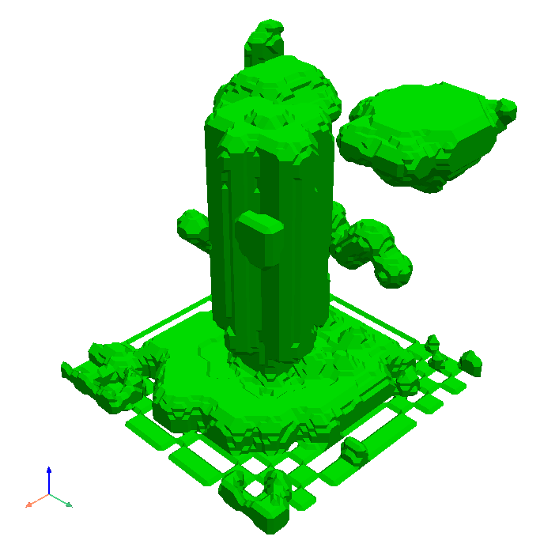

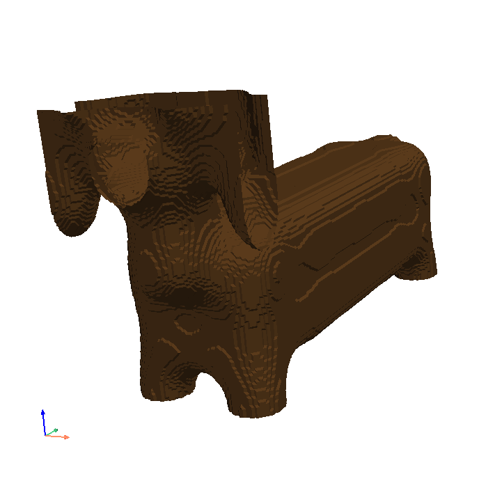

|meshisland|    |meshdog|

Notice the ``self.array`` arrays were resized in both objects with the global ``voxelmap.resize_array`` method. This was done to avoid the formation of voids that you still see on the dog mesh above.
The ``MarchingMesh`` method has a current limitation on small voxel models with low detail. It is not perfect, but this is an open-source package and it can always be developed further by 
the maintainer and/or other collaborators. 

Wavefront (.obj) file to 3-D Sparse Array 
-------------------------------------------------------

Voxelmap provides various features for converting Wavefront .obj files to its 3-D sparse arrays. However, the most straightforward approach is to use the global **voxelmap.objcast** method.

Cube Model
.................

To begin, let's download the `simple_cube.obj model file <https://raw.githubusercontent.com/andrewrgarcia/voxelmap/main/model_files/simple_cube.obj>`_. 
If you take a look at the file, you'll see that it specifies the z, y, and x coordinates of each vertex. However, in order to convert this model to a voxel-based representation, 
we need to define the spacing between points, since we're transforming from continuous coordinates to the discrete dimensions of a tensor.

To determine how the spacing affects the transformation from .obj to sparse array, we've provided a function below:

.. code-block:: python

   def draw_cube(spacing):

      array = vxm.objcast('simple_cube.obj',spacing) # Cast obj file as a point-cloud 3-D numpy array  
      model = vxm.Model(array)
      model.draw(coloring='custom: black',wireframe=True,wireframe_color='w',background_color='#000000',voxel_spacing=(1,1,1))

>>> draw_cube(spacing=1)
(see below)

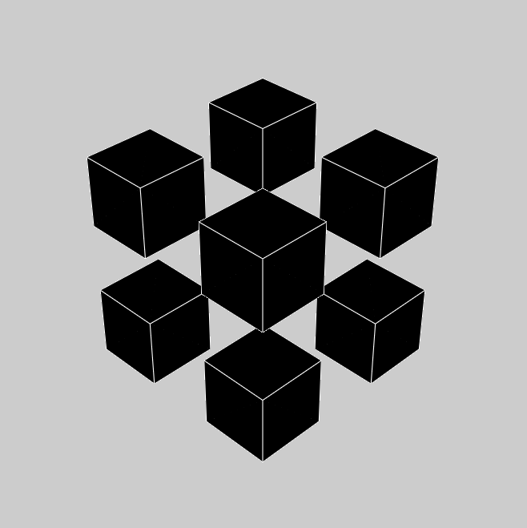

>>> draw_cube(spacing=0.5)
(see below)

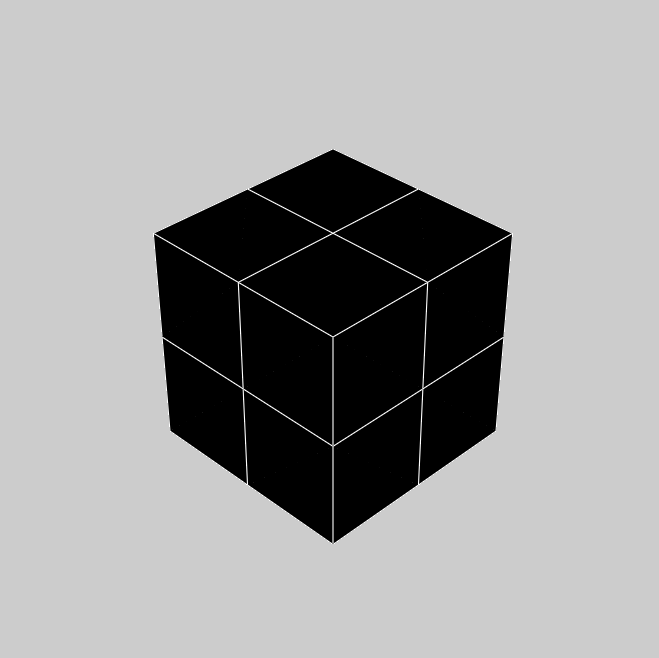

We can see a fractional spacing shows a more accurate model of a 2x2x2 supercube. 

Sphere Model
.................

This second example demonstrates how voxelmap can be utilized to convert the `sphere.obj MODEL <https://raw.githubusercontent.com/andrewrgarcia/voxelmap/main/model_files/simple_cube.obj>`_ 
into a discrete voxel array, which can then be triangulated using the **MarchingMesh**  local method.

.. code-block:: python

   def sphere_ptcloud(spacing):

      # Draw as point cloud of voxels
      array = vxm.objcast('sphere.obj',spacing) # Cast obj file as a point-cloud 3-D numpy array  
      model = vxm.Model(array)
      model.draw(coloring='custom: black',wireframe=True,wireframe_color='w',background_color='#000000',voxel_spacing=(1,1,1))

      # Draw as triangulated surface after applying Marching Cubes
      model.objfile= f"scene_marchingmesh{spacing}.obj"
      model.MarchingMesh()
      model.MeshView(wireframe=True,background_color='k',alpha=1)

The spacing parameter is crucial when working with the sphere.obj model, which has fractional coordinates between 0 and 1. The transformation from continuous coordinates to a discrete tensor space involves floor-dividing the coordinates, so using a spacing of 1 is likely to result in an unhelpful sparse 3-D tensor for voxel point cloud modeling. To address this issue, we initially set the spacing to 10 and obtained the following results.

>>> sphere_ptcloud(spacing=10)
(see below)

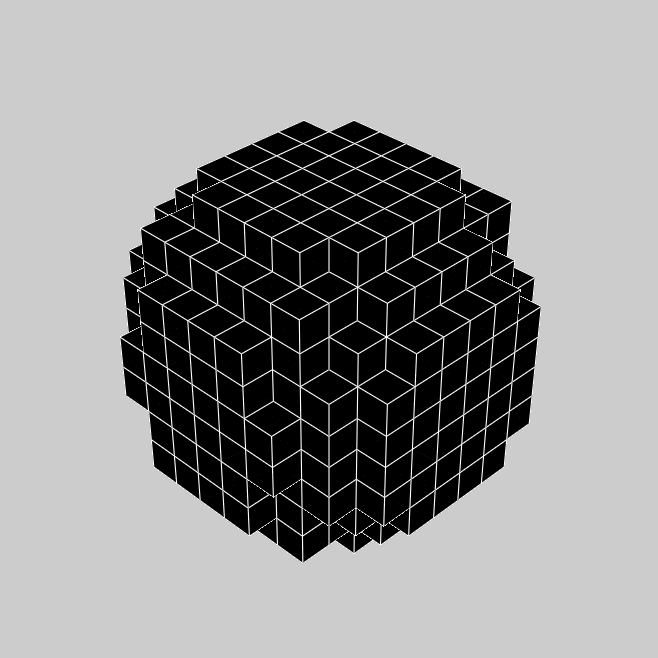

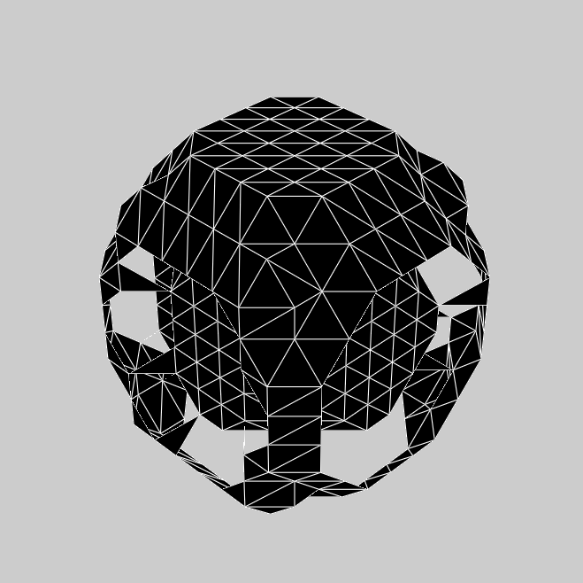

|sphere10| |sphere10mesh|

It is important to note that the spacing parameter plays a crucial role in transforming the .obj model to a discrete tensor space, especially when the model has 
fractional coordinates between 0 and 1. Setting a spacing value of 1 might not produce a useful sparse 3-D tensor for voxel point cloud modeling. In this example with the sphere model,
we set the spacing to 10 and obtained satisfactory results.

>>> sphere_ptcloud(spacing=30)
(see below)

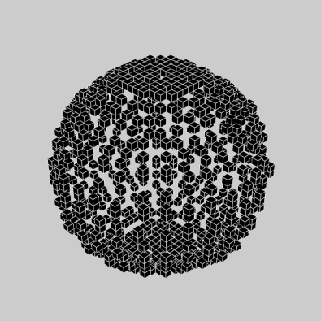

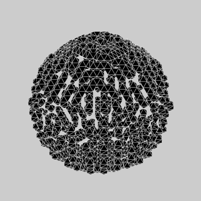

|sphere30| |sphere30mesh|

The MarchingMesh method typically output a Wavefront (.obj) file named ``scene.obj`` as default, but users can specify a different name by changing the 
objfile variable in the constructor of the **voxelmap.Model** class. Once the file is generated, it can be edited in software like `Blender <https://www.blender.org/>`_ by importing it.

The above commands generated 2 MarchingMesh .obj files, ``scene_marchingmesh10.obj`` and ``scene_marchingmesh30.obj`` for the different spacings chosen. These files can be imported simultaneously to a 
`Blender <https://www.blender.org/>`_ project, and they look like this:

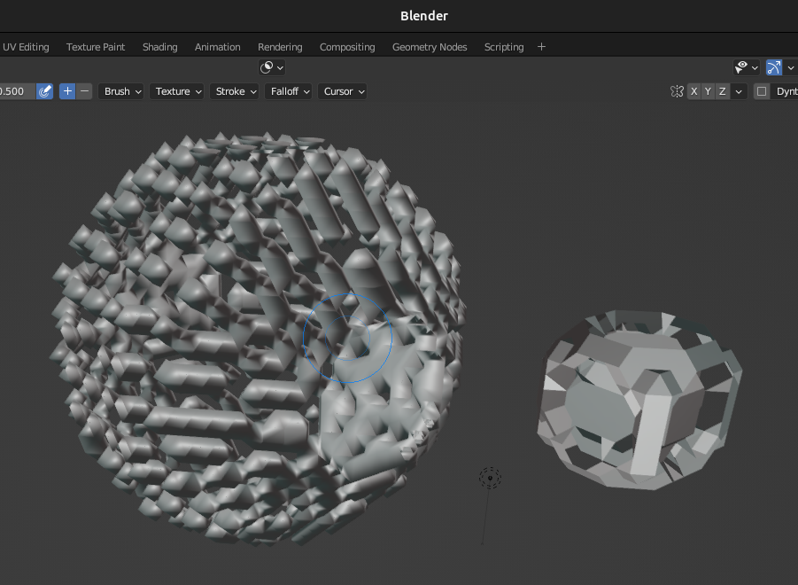

The larger spacing between voxels in a sphere can be observed to result in a larger overall size of the sphere.

.. _modelobjman:

3-D Model Numpy Manipulation and Blender Integration 
.........................................................

What if we wanted to make a modification to the .obj file with Numpy and then save the new modified model as an .obj file for additional treatment in other software like `Blender <https://www.blender.org/>`_?
Here we show a use case for that. Let's take the above **sphere_ptcloud()** function and make the following changes:

.. code-block:: python

   def sphere_skewer():
      
      array = vxm.objcast('sphere.obj',30) # Cast obj file as a point-cloud 3-D numpy array  

      #Numpy manipulation
      for i in range(30):
          x,y = np.random.randint(0,np.min(array.shape),2)
          array[x,y,:] = 1

      vxm.Model(array).save('pillars.obj')    #save the array as an .obj file

      model.objfile= f"pillars_mesh.obj"
      model.MarchingMesh()
      model.MeshView(wireframe=True,background_color='k',alpha=1)
      

The above code block loads the ``sphere.obj`` file, and casts it as a point-cloud 3D numpy array using 
the **objcast** method. It then makes 30 pillars in random x-y coordinates using Numpy. After this, the modified Numpy 
array containing the voxel model can be saved back to an .obj format as a NEW FILE using the local **save** method 
of the **voxelmap.Model** class.

The new ``pillars.obj`` file can be viewed with voxelmap with the below command

>>> vxm.MeshView('pillars.obj',alpha=1,wireframe=True)  # load for view with the global MeshView method
(see below)

And with Blender importing ``pillars_mesh.obj`` with the Import tool. Below are the outputs from the voxelmap (left) and the 
Blender (right) approach:

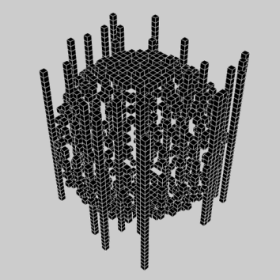

.. |pillars_blender| image:: ../img/objto3d/pillars_blender.png
  :width:  300
  :alt: Alternative text

|pillars_vxm| |pillars_blender|

3-D Voxel Model Reprocessing
-----------------------------------------

Here we do some reprocessing of the above `voxel` models. Note that here we use the ``draw_mpl`` method, which is voxelmap's legacy method for voxel modeling and not its state-of-the-art. For faster
and higher quality graphics with more kwargs / drawing options, use voxelmap's ``draw`` method instead.  

Re-color with custom colors
................................

using the ``hashblocks_add()`` method
^^^^^^^^^^^^^^^^^^^^^^^^^^^^^^^^^^^^^^

.. code-block:: python

   theIsland.hashblocks_add(1,'yellow',1)
   theIsland.hashblocks_add(2,'#333333',0.2)
   theIsland.hashblocks_add(3,'cyan',0.75)
   theIsland.hashblocks_add(4,'#000000')

   theIsland.draw_mpl('custom',figsize=(5,5))

   Dog.hashblocks = theIsland.hashblocks
   print('black dog, yellow eyes, cyan tongue')
   Dog.draw_mpl('custom',figsize=(5,5))

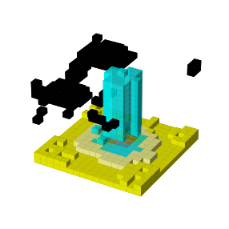

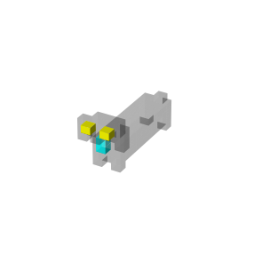

defining them directly in the hashblocks dictionary
^^^^^^^^^^^^^^^^^^^^^^^^^^^^^^^^^^^^^^^^^^^^^^^^^^^^^^^^^
.. code-block:: python

   theIsland.hashblocks = {
         1: ['cyan', 1], 
         2: ['#0197fd', 0.25], 
         3: ['#98fc66', 0.78], 
         4: ['#eeeeee', 1],
         5: ['red', 1]}

   theIsland.draw_mpl('custom',figsize=(7,7))

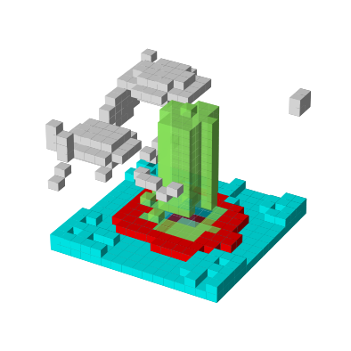

.. 
   Re-color with the rainbow colormap
   ^^^^^^^^^^^^^^^^^^^^^^^^^^^^^^^^^^^^^^

   .. code-block:: python

      from matplotlib import cm

      'draw with nuclear fill and rainbow colormap'
      theIsland.colormap = cm.rainbow
      theIsland.alphacm = 0.7

      print('rainbow island')
      theIsland.draw_mpl('linear',figsize=(7,7))

   .. image:: ../img/fromgoxel_6.png
   :width: 300
   :alt: Alternative text
   :target: https://goxel.xyz/

Save and Load Methods for voxelmap Model objects
...................................................

Save the ghost dog model
^^^^^^^^^^^^^^^^^^^^^^^^^^^^^^

If you'd like to save an array with customized color assignments, you may do so now with the ``Model().save()`` method. This method saves the array data as a DOK hashmap and integrates this DOK hashmap with the Model.hashblocks color information in a higher-order JSON file format:

.. code-block:: python

   #re-define colors for a ghost dog
   Dog.hashblocks = {
         1: ['cyan', 1], 
         2: ['#0197fd', 0.25], 
         3: ['#98fc66', 0.78], 
         4: ['#eeeeee', 1]}
         
   #save
   Dog.save('ghostdog.json')  

Load ghost dog model
^^^^^^^^^^^^^^^^^^^^^^

The ``Model().load()`` method processes the array and color information to a blank Model object. To load this data into a "blank slate" and re-draw it, type the following:

.. code-block:: python

   # defines a blank model
   blank = vxm.Model()
   print(blank.array)
   print(blank.hashblocks)

   blank.load('ghostdog.json')

   print(blank.array[0].shape)
   print(blank.hashblocks)
   blank.draw_mpl('custom',figsize=(7,7))

.. image:: ../img/fromgoxel_7.png
  :width: 300
  :alt: Alternative text
  :target: https://goxel.xyz/