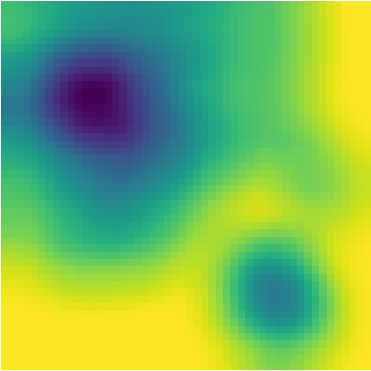

Usage
=====

.. _installation:

Installation
------------

It is recommended you use voxelmap through a virtual environment. You may follow the below simple protocol to create the virtual environment, run it, and install the package there:

.. code-block:: console
   
   $ virtualenv venv
   $ source venv/bin/activate
   (.venv) $ pip install voxelmap

To exit the virtual environment, simply type ``deactivate``. To access it at any other time again, enter with the above ``source`` command.

Draw voxels from an integer array
-------------------------------------

**Voxelmap** was originally made to handle third-order integer arrays of the form ``np.array((int,int,int))`` as blueprints to 3-D voxel models. 

While **"0"** integers are used to represent empty space, the non-zero integer values are used to define a distinct voxel type and thus, 
they are used as keys for such voxel type to be mapped to a specific color and ``alpha`` transparency. These keys are stored in a map (also known as "dictionary") 
internal to the ``voxelmap.Model`` class called ``hashblocks``. 

The voxel color and transparencies may be added or modified to the 
``hashblocks`` map with the ``hashblocksAdd`` method.

.. code-block:: python

   import voxelmap as vxm
   import numpy as np

   #make a 3x3x3 integer array with random values between 0 and 9
   array = np.random.randint(0,10,(3,3,3))
   print(array)

   #incorporate array to Model structure
   model = vxm.Model(array)

   #add voxel colors and alpha-transparency for integer values 0 - 9 (needed for `voxels` coloring)
   colors = ['#ffffff','black','#ffffff','k','yellow','#000000','white','k','#c745f8']
   for i in range(9):
   model.hashblocksAdd(i+1,colors[i])

   #draw array as a voxel model with `voxels` coloring scheme
   model.draw_mpl('voxels')
   
>>> [Out]
[[[3 8 5]
  [0 2 6]
  [2 2 7]]
 [[8 3 6]
  [7 2 0]
  [2 2 1]]
 [[9 2 4]
  [8 5 7]
  [8 9 8]]]

Draw voxels from coordinate arrays 
-------------------------------------

**Voxelmap** may also draw a voxel model from an array which defines the coordinates for each of the voxels to be drawn in x y and z space. 

The internal variable ``data.xyz`` will thus take a third-order array where the rows are the number of voxels and the columns are the 3 coordinates for the x,y,z axis. Another internal input, ``data.rgb``,
can be used to define the colors for each of the voxels in the ``data.xyz`` object in ``'xxxxxx'`` hex format (i.e. ``'ffffff'`` for white).

The algorithm will also work for negative coordinates, as it is shown in the example below. 

.. code-block:: python

   import voxelmap as vxm
   import numpy as np

   cubes = vxm.Model()          
   num_voxels = 30
   cubes.XYZ = np.random.randint(-1,1,(num_voxels,3))+np.random.random((num_voxels,3))          # random x,y,z locs for 10 voxels
   cubes.RGB = [ hex(np.random.randint(0.5e7,1.5e7))[2:] for i in range(num_voxels) ]   # define random colors for the 10 voxels
   cubes.sparsity = 5
                                                      # spaces out coordinates 
   cubes.load(coords=True)
   cubes.hashblocks 

   for i in cubes.hashblocks:
      cubes.hashblocks[i][1] = 0.30     # update all voxel alphas (transparency) to 0.3
   
   # print(cubes.XYZ)                               # print the xyz coordinate data
   cubes.draw_mpl('voxels',figsize=(5,5))                            # draw the model from that data

>>> [Out]
Color list built from file!
Model().hashblocks =
 {1: ['#4db692', 1], 2: ['#564bfb', 1], 3: ['#5915c1', 1], 4: ['#6283df', 1], 5: ['#6e5722', 1], 6: ['#6eebc3', 1], 7: ['#70cffa', 1], 8: ['#787ea7', 1], 9: ['#813c5b', 1], 10: ['#8906d7', 1], 11: ['#8a871d', 1], 12: ['#8ba24f', 1], 13: ['#930979', 1], 14: ['#932fde', 1], 15: ['#964c67', 1], 16: ['#9bafea', 1], 17: ['#9c248b', 1], 18: ['#9e5fff', 1], 19: ['#a2183b', 1], 20: ['#a248a6', 1], 21: ['#a63265', 1], 22: ['#a6c6a1', 1], 23: ['#aa381b', 1], 24: ['#ae9c6a', 1], 25: ['#b58c2c', 1], 26: ['#c114a1', 1], 27: ['#c618df', 1], 28: ['#d15d6e', 1], 29: ['#da6f7d', 1], 30: ['#e36ff6', 1]}

.. image:: ../img/voxcoords.png
  :width: 200
  :alt: Alternative text

Increase sparsity
^^^^^^^^^^^^^^^^^^^

The `sparsity` variable will extend the distance from all voxels at the expense of increased memory. 

.. code-block:: python

   cubes.sparsity = 12                                                      # spaces out coordinates 
   cubes.load(coords=True)
   for i in cubes.hashblocks:
      cubes.hashblocks[i][1] = 0.30     # update all voxel alphas (transparency) to 0.3
   
   cubes.draw_mpl('voxels',figsize=(12,12))                            # draw the model from that data

.. image:: ../img/voxcoords_sparse.png
  :width: 2000
  :alt: Alternative text

Get images for below examples 
--------------------------------

Click on the links below to save the images in the same directory you are running these examples:

`land.png <https://raw.githubusercontent.com/andrewrgarcia/voxelmap/main/extra/land.png>`_
`dog.png <https://raw.githubusercontent.com/andrewrgarcia/voxelmap/main/extra/dog.png>`_
`argisle.png <https://raw.githubusercontent.com/andrewrgarcia/voxelmap/main/extra/argisle.png>`_

3-D Mapping of an Image
--------------------------------

Here we map the synthetic topography image `land.png <https://raw.githubusercontent.com/andrewrgarcia/voxelmap/main/extra/land.png>`_ we just downloaded to 3-D using the ``map3d`` method from the ``voxelmap.Image`` class.

.. code-block:: python

   #import packages
   import cv2
   import matplotlib.pyplot as plt

   plt.imshow(cv2.imread('land.png'))      # display fake land topography .png file as plot
   plt.axis('off')
   plt.show()

   #import packages
   import numpy as np
   from matplotlib import cm

   img = vxm.Image('land.png')             # incorporate fake land topography .png file to voxelmap.Image class
   print(img.array.shape)

The image is then resized for the voxel draw with the matplotlib method i.e. ``Model().draw_mpl``. This is done with ``cv2.resize``, resizing the image from 1060x1060 to 50x50. After resizing, we convolve the image to obtain a less sharp color shift between the different gray regions with the ``cv2.blur`` method:

.. code-block:: python

   img.array = cv2.resize(img.array, (50,50), interpolation = cv2.INTER_AREA)
   print(img.array.shape)

   img.array = cv2.blur(img.array,(10,10))    # blur the image for realiztic topography levels
   plt.imshow(img.array)      # display fake land topography .png file as plot
   plt.axis('off')
   plt.show()

After this treatment, the resized and blurred image is mapped to a 3-D voxel model using the `ImageMap` method from the `Image` class:

.. code-block:: python

   mapped_img = img.ImageMap(12)              # mapped to 3d with a depth of 12 voxels
   print(mapped_img.shape)
   model = vxm.Model(mapped_img)
   model.array = np.flip(np.transpose(model.array))

   model.colormap = cm.terrain
   model.alphacm = 0.5
   model.draw_mpl('linear',figsize=(15,12))

ImageMesh : 3-D Mesh Mapping from Image
-----------------------------------------

This method creates a low-poly mesh model from an Image using an algorithm developed by Andrew Garcia where 3-D convex hull is performed on separate "cuts" or sectors from the image. 

This can decrease the size of the 3-D model and the runtime to generate it significantly, making the runtime proportional to the number of sectors rather than the number of pixels. Sectors are quantified with the L_sectors kwarg, which is the length scale for the number of sectors in the grid. 

We can see that the mesh model can be calculated and drawn with matplotlib ``plot=mpl`` option even from a large image of 1060x1060 without resizing:

.. code-block:: python

   import voxelmap as vxm
   import cv2 

   img = vxm.Image('land.png')   # incorporate fake land topography .png file

   print(img.array.shape)

   img.ImageMesh(out_file='model.obj', L_sectors = 15, trace_min=5, rel_depth = 20, figsize=(15,12), plot='mpl')

.. image:: ../img/land_imagemesh.png
  :width: 350
  :alt: Alternative text

This ``ImageMesh`` transformation is also tested with a blurred version of the image with ``cv2.blur``. A more smooth low-poly 3-D mesh is generated with this additional treatment. The topography seems more realistic:

.. code-block:: python

   img.array = cv2.blur(img.array,(60,60))    # blur the image for realiztic topography levels
   img.ImageMesh(out_file='model.obj', L_sectors = 15, trace_min=5, rel_depth = 20, figsize=(15,12), plot='mpl')

.. image:: ../img/land_imagemesh_blur.png
  :width: 350
  :alt: Alternative text

For a more customizable OpenGL rendering, ``img.MeshView()`` may be used on the above image:

.. code-block:: python

   import voxelmap as vxm
   import numpy as np
   import cv2 as cv

   img = vxm.Image('land.png')           # incorporate fake land topography .png file
   img.array = cv.blur(img.array,(100,100))    # blur the image for realistic topography levels

   img.make()                                  # resized to 1.0x original size i.e. not resized (default)

   img.ImageMesh('land.obj',  12, 14, 1, False, figsize=(10,10))

   img.MeshView( alpha=0.7,background_color='#3e404e',color='white',viewport=(700, 700))

.. image:: ../img/land_meshview.png
  :width: 350
  :alt: Alternative text

