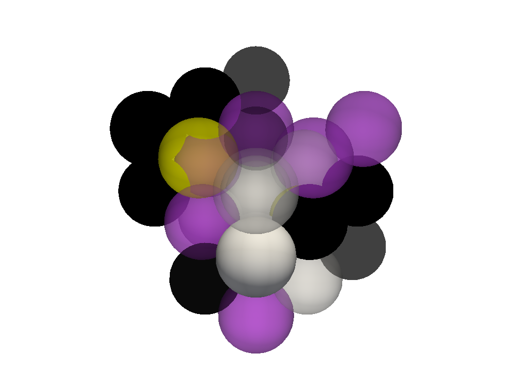
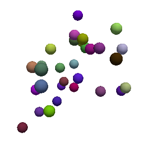
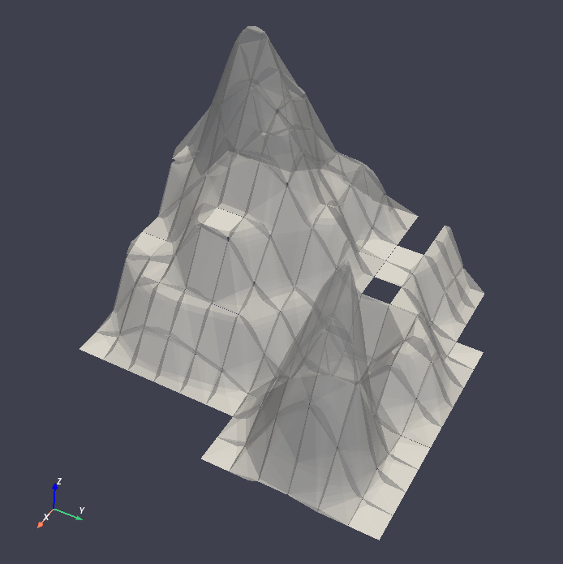
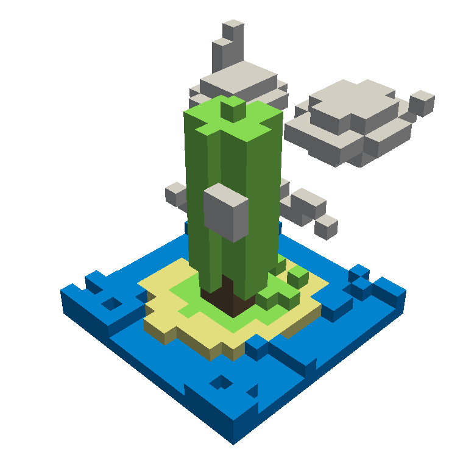
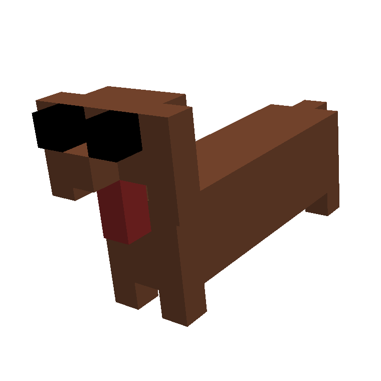
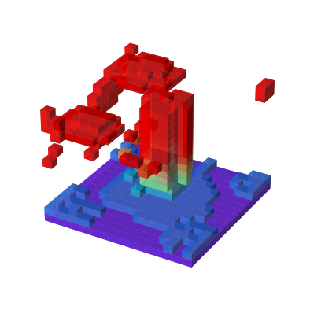
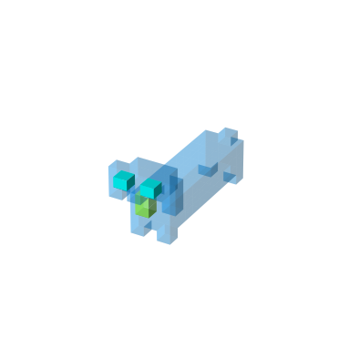

Usage
=====

.. _installation:

Installation
------------

It is recommended you use voxelmap through a virtual environment. You may follow the below simple protocol to create the virtual environment, run it, and install the package there:

.. code-block:: console
   
   $ virtualenv venv
   $ source venv/bin/activate
   (.venv) $ pip install voxelmap

To exit the virtual environment, simply type ``deactivate``. To access it at any other time again, enter with the above ``source`` command.

Draw voxels from an integer array
-------------------------------------

**Voxelmap** was originally made to handle third-order integer arrays of the form ``np.array((int,int,int))`` as blueprints to 3-D voxel models. 

While **"0"** integers are used to represent empty space, the non-zero integer values are used to define a distinct voxel type and thus, 
they are used as keys for such voxel type to be mapped to a specific color and ``alpha`` transparency. These keys are stored in a map (also known as "dictionary") 
internal to the ``voxelmap.Model`` class called ``hashblocks``. 

The voxel color and transparencies may be added or modified to the 
``hashblocks`` map with the ``hashblocksAdd`` method.

.. code-block:: python

   import voxelmap as vxm
   import numpy as np

   #make a 3x3x3 integer array with random values between 0 and 9
   array = np.random.randint(0, 10, (3, 3, 3))
   print(array)

   #incorporate array to Model structure
   model = vxm.Model(array)

   #add voxel colors and alpha-transparency for integer values 0 - 9 (needed for `custom` coloring)
   colors = ['#ffffff', 'black', '#ffffff', 'k',
            'yellow', '#000000', 'white', 'k', '#c745f8']
   for i in range(9):
      model.hashblocksAdd(i+1, colors[i])

   #draw array as a voxel model with `custom` coloring scheme
   model.draw('custom', background_color='#ffffff')
   
>>> [Out]
[[[3 8 5]
  [0 2 6]
  [2 2 7]]
 [[8 3 6]
  [7 2 0]
  [2 2 1]]
 [[9 2 4]
  [8 5 7]
  [8 9 8]]]

.. image:: ../img/voxels_solid.png
  :width: 200
  :alt: Alternative text

With particles geometry and user-defined ``alpha`` transparencies
...........................................................................
The new version of voxelmap now has a ``geometry`` kwarg for the ``Model.draw()`` method where the voxel geometry can be chosen between `voxels` and `particles` form. Below we change it to `particles` to represent the voxels above as spherical objects. In addition, we declare different transparencies of the different voxel-item types:

.. code-block:: python

   alphas = [0.8,1,0.5,1,0.75,0.5,1.0,0.8,0.6]
   for i in range(9):
   model.hashblocksAdd(i+1,colors[i],alphas[i])
   model.draw('custom', geometry='particles', background_color='#ffffff')

Draw voxels from coordinate arrays 
-------------------------------------

**Voxelmap** may also draw a voxel model from an array which defines the coordinates for each of the voxels to be drawn in x y and z space. 

The internal variable ``data.xyz`` will thus take a third-order array where the rows are the number of voxels and the columns are the 3 coordinates for the x,y,z axis. Another internal input, ``data.rgb``,
can be used to define the colors for each of the voxels in the ``data.xyz`` object in ``'xxxxxx'`` hex format (i.e. ``'ffffff'`` for white).

The algorithm will also work for negative coordinates, as it is shown in the example below. 

.. code-block:: python

   import voxelmap as vxm
   import numpy as np

   cubes = vxm.Model()          
   num_voxels = 30
   cubes.XYZ = np.random.randint(-1,1,(num_voxels,3))+np.random.random((num_voxels,3))          # random x,y,z locs for 10 voxels
   cubes.RGB = [ hex(np.random.randint(0.5e7,1.5e7))[2:] for i in range(num_voxels) ]   # define random colors for the 10 voxels
   cubes.sparsity = 5
                                                      # spaces out coordinates 
   cubes.load(coords=True)
   cubes.hashblocks 

   for i in cubes.hashblocks:
      cubes.hashblocks[i][1] = 0.30     # update all voxel alphas (transparency) to 0.3

   # print(cubes.XYZ)                               # print the xyz coordinate data
   cubes.draw('custom',geometry='particles', background_color='#ffffff',window_size=[416, 416])                            # draw the model from that data

>>> [Out]
Color list built from file!
Model().hashblocks =
 {1: ['#4db692', 1], 2: ['#564bfb', 1], 3: ['#5915c1', 1], 4: ['#6283df', 1], 5: ['#6e5722', 1], 6: ['#6eebc3', 1], 7: ['#70cffa', 1], 8: ['#787ea7', 1], 9: ['#813c5b', 1], 10: ['#8906d7', 1], 11: ['#8a871d', 1], 12: ['#8ba24f', 1], 13: ['#930979', 1], 14: ['#932fde', 1], 15: ['#964c67', 1], 16: ['#9bafea', 1], 17: ['#9c248b', 1], 18: ['#9e5fff', 1], 19: ['#a2183b', 1], 20: ['#a248a6', 1], 21: ['#a63265', 1], 22: ['#a6c6a1', 1], 23: ['#aa381b', 1], 24: ['#ae9c6a', 1], 25: ['#b58c2c', 1], 26: ['#c114a1', 1], 27: ['#c618df', 1], 28: ['#d15d6e', 1], 29: ['#da6f7d', 1], 30: ['#e36ff6', 1]}

Increase sparsity
....................

The `sparsity` variable will extend the distance from all voxels at the expense of increased memory. 

.. code-block:: python

   cubes.sparsity = 12                                                      # spaces out coordinates 
   cubes.load(coords=True)
   for i in cubes.hashblocks:
      cubes.hashblocks[i][1] = 0.30     # update all voxel alphas (transparency) to 0.3

   cubes.draw('custom', geometry='particles', background_color='#ffffff',window_size=[1000, 1000])                            # draw the model from that data

Get files for below examples 
--------------------------------

Click on the links below to save the files in the same directory you are running these examples:

`LAND IMAGE (.png) <https://raw.githubusercontent.com/andrewrgarcia/voxelmap/main/docs/img/land.png>`_

`DOG MODEL (.txt) <https://raw.githubusercontent.com/andrewrgarcia/voxelmap/main/model_files/dog.txt>`_

`ISLAND MODEL (.txt) <https://raw.githubusercontent.com/andrewrgarcia/voxelmap/main/model_files/argisle.txt>`_

3-D Mapping of an Image
--------------------------------

Here we map the synthetic topography image `land.png <https://raw.githubusercontent.com/andrewrgarcia/voxelmap/main/extra/land.png>`_ we just downloaded to 3-D using the ``map3d`` method from the ``voxelmap.Image`` class.

.. code-block:: python

   #import packages
   import cv2
   import matplotlib.pyplot as plt

   plt.imshow(cv2.imread('land.png'))      # display fake land topography .png file as plot
   plt.axis('off')
   plt.show()

   #import packages
   import numpy as np
   from matplotlib import cm

   img = vxm.Image('land.png')             # incorporate fake land topography .png file to voxelmap.Image class
   print(img.array.shape)

.. image:: ../img/land_small.png
  :width: 200
  :alt: Alternative text

The image is then resized for the voxel draw with the matplotlib method i.e. ``Model().draw_mpl``. This is done with ``cv2.resize``, resizing the image from 1060x1060 to 50x50. After resizing, we convolve the image to obtain a less sharp color shift between the different gray regions with the ``cv2.blur`` method:

.. code-block:: python

   img.array = cv2.resize(img.array, (50,50), interpolation = cv2.INTER_AREA)
   print(img.array.shape)

   img.array = cv2.blur(img.array,(10,10))    # blur the image for realiztic topography levels
   plt.imshow(img.array)      # display fake land topography .png file as plot
   plt.axis('off')
   plt.show()

.. image:: ../img/land_blurred.png
  :width: 200
  :alt: Alternative text

After this treatment, the resized and blurred image is mapped to a 3-D voxel model using the `ImageMap` method from the `Image` class:

.. code-block:: python

   mapped_img = img.ImageMap(12)              # mapped to 3d with a depth of 12 voxels
   print(mapped_img.shape)
   model = vxm.Model(mapped_img)
   model.array = np.flip(np.transpose(model.array))

   model.alphacm = 0.5
   model.draw('none',background_color='#ffffff')

.. image:: ../img/land_imagemap.png
  :width: 350
  :alt: Alternative text

ImageMesh : 3-D Mesh Mapping from Image
-----------------------------------------

This method creates a low-poly mesh model from an Image using an algorithm developed by Andrew Garcia where 3-D convex hull is performed on separate "cuts" or sectors from the image (see: :doc:`imagemesh`). 

This can decrease the size of the 3-D model and the runtime to generate it significantly, making the runtime proportional to the number of sectors rather than the number of pixels. Sectors are quantified with the L_sectors kwarg, which is the length scale for the number of sectors in the grid. 

We can see that the mesh model can be calculated and drawn with matplotlib ``plot=mpl`` option even from a large image of 1060x1060 without resizing:

.. code-block:: python

   import voxelmap as vxm
   import cv2 

   img = vxm.Image('land.png')   # incorporate fake land topography .png file

   print(img.array.shape)

   img.ImageMesh(out_file='model.obj', L_sectors = 15, trace_min=5, rel_depth = 20, figsize=(15,12), plot='mpl')

This ``ImageMesh`` transformation is also tested with a blurred version of the image with ``cv2.blur``. A more smooth low-poly 3-D mesh is generated with this additional treatment. The topography seems more realistic:

.. code-block:: python

   img.array = cv2.blur(img.array,(60,60))    # blur the image for realiztic topography levels
   img.ImageMesh(out_file='model.obj', L_sectors = 15, trace_min=5, rel_depth = 20, figsize=(15,12), plot='mpl')

For a more customizable OpenGL rendering, ``img.MeshView()`` may be used on the above image:

.. code-block:: python

   import voxelmap as vxm
   import numpy as np
   import cv2 as cv

   img = vxm.Image('land.png')           # incorporate fake land topography .png file
   img.array = cv.blur(img.array,(100,100))    # blur the image for realistic topography levels

   img.make()                                  # resized to 1.0x original size i.e. not resized (default)

   img.ImageMesh('land.obj',  12, 14, 1, False, figsize=(10,10))

   img.MeshView( alpha=0.7,background_color='#3e404e',color='white',viewport=(700, 700))

MarchingMesh : Turning Voxel Models to 3-D Mesh Representations
-------------------------------------------------------------------

The ``.txt`` files you downloaded were exported from Goxel projects. Goxel is an open-source and cross-platform voxel editor which facilitates the graphical creation of voxel models. More information by clicking the icon link below.  

We first load those ``.txt`` files with the below voxelmap methods: 

.. code-block:: python

   import voxelmap as vxm
   import numpy as np

   '''process argisle.txt from Goxel'''
   theIsland = vxm.Model()
   theIsland.load('argisle.txt')
   theIsland.array = np.transpose(theIsland.array,(2,1,0))    #rotate island
   theIsland.draw('custom',background_color='white')

   '''process dog.txt from Goxel'''
   Dog = vxm.Model()
   Dog.load('dog.txt')
   Dog.array = np.transpose(Dog.array,(2,1,0))     #rotate dog
   Dog.draw('custom',background_color='white')

|voxisland|           |voxdog|

The voxel models can be transformed to 3D mesh representations with voxelmap's ``Model().MarchingMesh`` method, which uses `Marching Cubes` from the ``scikit-image`` Python library. 

.. code-block:: python

   '''MarchingMesh on island model'''
   theIsland.array = vxm.resize_array(theIsland.array,(5,5,5)) #make array larger before mesh transformation
   theIsland.MarchingMesh()
   theIsland.MeshView(color='lime',wireframe=False,background_color='white',alpha=1,viewport=[700,700])

   '''MarchingMesh on dog model'''
   Dog.array = vxm.resize_array(Dog.array,(20,20,20)) #make array larger before mesh transformation
   Dog.MarchingMesh()
   Dog.MeshView(color='brown',wireframe=False,background_color='white',alpha=1,viewport=[700,700])

|meshisland|          |meshdog|

Notice the ``self.array`` arrays were resized in both objects with the global ``voxelmap.resize_array`` method. This was done to avoid the formation of voids that you still see on the dog mesh above.
The ``MarchingMesh`` method has a current limitation on small voxel models with low detail. It is not perfect, but this is an open-source package and it can always be developed further by 
the maintainer and/or other collaborators. 

3-D Voxel Model Reprocessing
-----------------------------------------

Here we do some reprocessing of the above `voxel` models. Note that here we use the ``draw_mpl`` method, which is ``voxelmap``'s legacy method for voxel modeling and not its state-of-the-art. For faster
and higher quality graphics with more kwargs / drawing options, use ``voxelmap``'s ``draw`` method instead.  

Re-color with custom colors
................................

using the ``hashblocksAdd()`` method
^^^^^^^^^^^^^^^^^^^^^^^^^^^^^^^^^^^^^^

.. code-block:: python

   theIsland.hashblocksAdd(1,'yellow',1)
   theIsland.hashblocksAdd(2,'#333333',0.2)
   theIsland.hashblocksAdd(3,'cyan',0.75)
   theIsland.hashblocksAdd(4,'#000000')

   theIsland.draw_mpl('custom',figsize=(5,5))

   Dog.hashblocks = theIsland.hashblocks
   print('black dog, yellow eyes, cyan tongue')
   Dog.draw_mpl('custom',figsize=(5,5))

defining them directly in the hashblocks dictionary
^^^^^^^^^^^^^^^^^^^^^^^^^^^^^^^^^^^^^^^^^^^^^^^^^^^^^^^^^
.. code-block:: python

   theIsland.hashblocks = {
         1: ['cyan', 1], 
         2: ['#0197fd', 0.25], 
         3: ['#98fc66', 0.78], 
         4: ['#eeeeee', 1],
         5: ['red', 1]}

   theIsland.draw_mpl('custom',figsize=(7,7))

Re-color with the rainbow colormap
^^^^^^^^^^^^^^^^^^^^^^^^^^^^^^^^^^^^^^

.. code-block:: python

   from matplotlib import cm

   'draw with nuclear fill and rainbow colormap'
   theIsland.colormap = cm.rainbow
   theIsland.alphacm = 0.7

   print('rainbow island')
   theIsland.draw_mpl('linear',figsize=(7,7))

Save and Load Methods for voxelmap Model objects
...................................................

Save the ghost dog model
^^^^^^^^^^^^^^^^^^^^^^^^^^^^^^

If you'd like to save an array with customized color assignments, you may do so now with the ``Model().save()`` method. This method saves the array data as a DOK hashmap and integrates this DOK hashmap with the Model.hashblocks color information in a higher-order JSON file format:

.. code-block:: python

   #re-define colors for a ghost dog
   Dog.hashblocks = {
         1: ['cyan', 1], 
         2: ['#0197fd', 0.25], 
         3: ['#98fc66', 0.78], 
         4: ['#eeeeee', 1]}
         
   #save
   Dog.save('ghostdog.json')  

Load ghost dog model
^^^^^^^^^^^^^^^^^^^^^^

The ``Model().load()`` method processes the array and color information to a blank Model object. To load this data into a "blank slate" and re-draw it, type the following:

.. code-block:: python

   # defines a blank model
   blank = vxm.Model()
   print(blank.array)
   print(blank.hashblocks)

   blank.load('ghostdog.json')

   print(blank.array[0].shape)
   print(blank.hashblocks)
   blank.draw_mpl('custom',figsize=(7,7))

